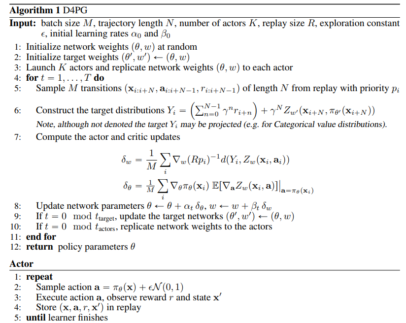
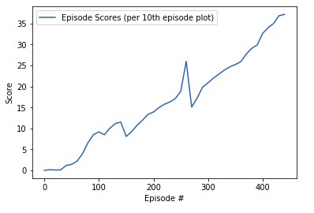

# Project Report - Collaboration and Competition

## Learning algorithm

The learning algorithm used is Distributional Distributed Deep Deterministic Policy Gradients (D4PG).  
The algorithm consists of 2 seperate agents each with set of 2 neural networks - actor and critic.  
The actor network takes observation as an input and outputs actions.   
The critic network is used to compute state-action values. It outputs 1 real number - state value estimate for the given agent's actions and local observations for the agent as input.  
The algorithm has separate learner and actors. The job of the actors is just to sample from the environment and add it with priority into the replay buffer. 
The learner samples from the replay buffer, learns and updates the priorities of the samples that it learned from. This ensures that the initially "very wrong calculated priorities" don't keep on affecting every time. 

### The D4PG algorithm works as follows:

## Parameters and hyperparameters

### Neural networks

#### Actor network

- 2 fully connected hidden layers
- 33 input nodes [observation vector size for single agent], 4 output nodes [action vector size]
- 128 hidden nodes in first layer and 128 in second layer
- ReLU activations, tanh on last layer
- Gaussian Noise applied to final action output to promote exploration

#### Critic network

- 3 fully connected hidden layers.
- fcs1 takes Observation vector [size 33] and connects it to 128-sized hidden layer.
- fca1 takes Action Vector [size 4] and connects it to 32-sized hidden layer.
- fc2 takes 37 input nodes [observation vector size + action vector size] and outputs 64 sized vector
- Observation vector [size 24] connected to 400-sized hidden layer
- Finally the 64 layer output connected to a hidden layer which outputs 1 Q(s,a) value.
- ReLU activations

### Main hyperparameters

- Discount Factor, Gamma - `0.99`
- Soft Update Rate, Tau - `1e-3`
- Buffer size - `1e6`
- Batch size - `256`
- Update frequency - `10` times in every `20` timesteps
- Optimizer - `Adam`
- ALPHA - `1e-4`
- BETA - `1e-4`
- Rollout length - `5`
- TD_EPSILON = `1e-3`
- NOISE_EPSILON = `0.3`
- Learner network copied to actor network every `200` timesteps
- Maximum episode length - `1000`

## Results

The chart above shows an average reward over 100 consecutive episodes. 
The agent reaches the level required for considering environment solved in 342 episodes. 

## Future Work

### 1. Hyperparameter Tuning
Trying different network layer units. 
Can also try adding noise to network parameters rather than adding to final action output.

### 2. Trying out other environments
The Crawler agent should be fun and challenging enough to try. I would also like to create my own unity environment and try this algorithm out.

### 3. MultiAgent D4PG
Next try to use D4PG in a multi agent learning task. 

